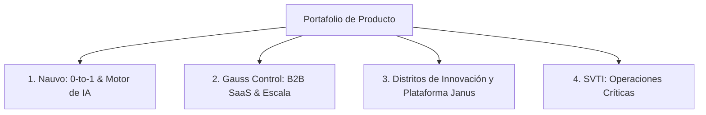

# Juan Pablo Silva | Product Management Portfolio

> **Senior Product Manager & Founder**  
> *Evidence-Driven Product Discovery · B2B SaaS · AI & Decision Systems*  
> Santiago, Chile · [LinkedIn](https://linkedin.com/in/jpablosilva) · [GitHub](https://github.com/jotapesvz)

---

## 🎯 Perfil Ejecutivo

Ingeniero Civil Industrial con Magíster en Innovación (Universidad de Concepción) y certificación **PSPO I (Scrum.org)**. Cuento con más de 7 años de experiencia combinada liderando Product Management, Product Operations y equipos multidisciplinarios de desarrollo en entornos de alta incertidumbre y riesgo operacional.

Mi propuesta de valor une tres pilares:
1. **Evidence-Driven Discovery:** Validación de hipótesis, prototipado rápido y diseño de soluciones basadas en datos y modelos de decisión.
2. **Delivery & Escala Ágil:** Liderazgo de células de ingeniería, gestión de backlog y optimización de eficiencia operativa.
3. **Technical Product Management:** Capacidad de traducir modelos matemáticos, arquitecturas de IA (simbólica / generativa / agentes) y ciencia en productos de software escalables y comercializables.

---

## 📊 Métricas de Impacto Destacadas

| **+30%** | **16.000** | **TRL 3 ➔ TRL 4** | **2.000+** |
| :---: | :---: | :---: | :---: |
| +30% en [[JP: completar — métrica exacta, ej. tiempo de resolución de tickets de soporte]] ([[JP: completar — período de medición]]) | Producto con 16.000 usuarios activos en terreno ([[JP: completar — ventana: MAU/DAU]]), minería | Maduración de motor de riesgo con IA (al [[JP: completar — mes/año]]) | 2.000+ descargas sobre base de [[JP: completar — universo instalado]] |

---

## 📂 Casos de Estudio

### [1. Nauvo — Motor de Inferencia para Evaluación de Riesgo en Startups](./cases/01-nauvo-risk-engine.md)
* **Rol:** Product Manager & Co-Fundador (Agosto 2026 – Presente)
* **Tipo:** 0 to 1 · B2B FinTech / Venture Capital · IA Simbólica & Agentes
* **Resumen:** Desarrollo de un motor de inferencia determinista sobre grafos dirigidos acíclicos (DAG) para evaluar riesgo en startups en etapas tempranas. Definición de métricas de calidad para sistemas no deterministas, creación de prototipo funcional (TRL 4) y captación de 3 clientes piloto y 1 fondo de VC interesado (al [[JP: completar — mes/año]]).
* **[Ver Caso Completo ➔](./cases/01-nauvo-risk-engine.md)** | **[Ver Artefacto Técnico / Demo ➔](./artifacts/nauvo/)**

### [2. Gauss Control — Monitoreo de Personas y Riesgo Humano](./cases/02-gauss-control-monitoring.md)
* **Rol:** Product Owner (Mayo 2026 – Agosto 2026)
* **Tipo:** B2B SaaS Enterprise · Minería e Industria Pesada · IoT / Neurociencia
* **Resumen:** Liderazgo funcional de célula ágil (Tech Lead, BA, Devs). Priorización de roadmap basado en causales de accidentabilidad. Producto con 16.000 usuarios activos en terreno ([[JP: completar — ventana: MAU/DAU]]), 2.000+ descargas sobre base de [[JP: completar — universo instalado]] y +30% en [[JP: completar — métrica exacta, ej. tiempo de resolución de tickets de soporte]] ([[JP: completar — período de medición]]).
* **[Ver Caso Completo ➔](./cases/02-gauss-control-monitoring.md)**

### [3. Distritos de Innovación y Plataforma Janus](./cases/03-janus-tech-transfer.md)
* **Rol:** Product Manager & Estratega de Ecosistemas (Enero 2022 – Mayo 2026)
* **Tipo:** Ecosistemas DeepTech · Alianza CMPC · Georgia Tech Benchmark
* **Resumen:** Formulación estratégica de producto para distritos territoriales de innovación (iD3 Biobío y CIDLA Los Ángeles junto a CMPC) y orquestación con la plataforma Janus. Modelo financiero del distrito evaluado en USD 142M VAN / 14,3% TIR. Mi rol: especificación de los centros de Industria 4.0 y de Data Science / IA.
* **[Ver Caso Completo ➔](./cases/03-janus-tech-transfer.md)**

### [4. SVTI — Eficiencia y Gestión de Flujos Críticos en Operaciones Portuarias](./cases/04-svti-operations.md)
* **Rol:** Operations Manager (Diciembre 2017 – Enero 2021)
* **Tipo:** Operaciones Marítimas y Logística Internacional · Data Analytics
* **Resumen:** Reducción de Lead Time y cuellos de botella en operaciones portuarias de exportación masiva. Negociación de SLAs con clientes corporativos y digitalización de reportes de gestión operativa en tiempo real.
* **[Ver Caso Completo ➔](./cases/04-svti-operations.md)**

---

## 🛠️ Stack & Metodologías

* **Product Strategy & Discovery:** Continuous Discovery, Customer Development, User Interviews, Hipótesis & Experimentos, RICE/MoSCoW, Opportunity Solution Trees.
* **Agile Delivery:** Scrum (PSPO I), Kanban, Jira, Confluence, Backlog Refinement, User Stories, Acceptance Criteria.
* **Data & Analytics:** Python, SQL, Looker Studio, R, Stata, Modelado Estadístico.
* **AI & Tecnologías Emergentes:** Grafos dirigidos (DAG), IA Simbólica, LLMs, Asistentes Agénticos (Claude Code, Google Antigravity).

---

## 📬 Contacto

* **LinkedIn:** [linkedin.com/in/jpablosilva](https://linkedin.com/in/jpablosilva)
* **GitHub:** [github.com/jotapesvz](https://github.com/jotapesvz)
* **Ubicación:** Las Condes, Santiago, Chile (Disponible para roles Remoto / Híbrido)
