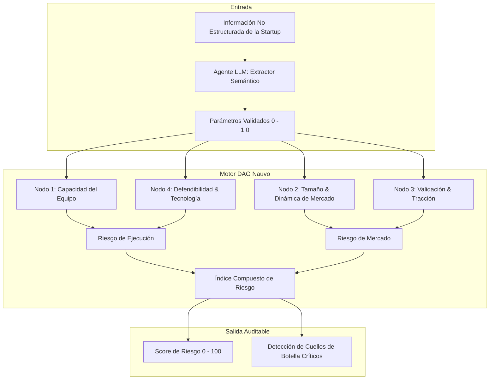

# Artefacto Técnico: Prototipo Motor de Riesgo Nauvo (TRL 4)

Este artefacto documenta la arquitectura técnica y un prototipo funcional interactivo del motor de inferencia determinista de **Nauvo**.

---

## 💡 Concepto & Filosofía de Diseño

En la evaluación de startups en etapas pre-semilla, los modelos predictivos de "caja negra" (como redes neuronales densas o LLMs sin anclaje) sufren de tres fallas críticas para los comités de inversión:
1. **Alucinación / No Determinismo:** La misma startup analizada dos veces produce respuestas o puntuaciones distintas.
2. **Falta de Trazabilidad Causal:** No se puede auditar con precisión qué variable desencadenó una alerta roja o devaluación.
3. **Escasez de Datos Numéricos en Pre-Seed:** No hay estados financieros auditados de 5 años; la mayoría de los datos son cualitativos.

### La Solución de Nauvo:
* **Entrada Asistida por Agentes de IA:** Los LLMs se usan exclusivamente como interfaz de extracción semántica (parseo de memorandos, respuestas de fundadores y métricas a parámetros estructurados).
* **Cálculo Determinista sobre Grafo (DAG):** Una vez extraídos los parámetros, el cálculo de riesgo y parsimonia se ejecuta sobre un **Grafo Dirigido Acíclico (DAG)** con reglas de inferencia deterministas y ponderaciones empíricas estáticas.



---

## 🚀 Cómo Ejecutar la Demo Localmente

El prototipo interactivo está implementado en un script de Python limpio, sin dependencias externas pesadas:

```bash
cd artifacts/nauvo
python engine_demo.py
```

### Qué demuestra este artefacto a un reclutador / evaluador:
* **Product Sense Técnico:** Comprensión profunda de cómo acoplar modelos probabilísticos (LLMs) con modelos deterministas para industrias reguladas o financieras.
* **Habilidad de Prototipado Rápido:** Capacidad de construir un MVP funcional para validar clientes piloto sin depender de semanas de desarrollo previo.
