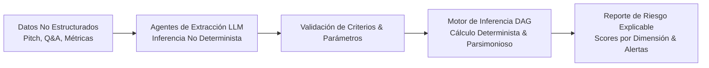

# Caso 01: Nauvo — Motor de Inferencia para Evaluación de Riesgo en Startups

* **Rol:** Product Manager & Co-Founder
* **Período:** Agosto 2026 – Presente
* **Tipo de Producto:** 0 to 1 · FinTech / Venture Capital Tooling · IA Simbólica & Agentes
* **Contexto:** Spin-out y evolución aplicada de tesis de Magíster en Innovación (Universidad de Concepción).

---

## 1. El Problema (Problem Statement)
En etapas tempranas (*Pre-seed* y *Seed*), más del 80% de las decisiones de inversión en startups se toman basándose en sesgos cognitivos, intuición y presentaciones superficiales (pitch decks). Los fondos de Venture Capital e inversionistas ángeles carecen de herramientas objetivas, reproducibles e interpretables para auditar la coherencia interna de las tesis de inversión y cuantificar el riesgo de incertidumbre.

> **Objetivo de Producto:** Diseñar un sistema que transforme la evaluación cualitativa y desestructurada de una startup en un análisis de riesgo determinista, auditable y con salida interpretable.

---

## 2. Hipótesis & Product Discovery

### Hipótesis Centrales:
1. **Interpretabilidad > Caja Negra:** Los inversionistas institucionales rechazan modelos de IA de tipo "caja negra" que arrojan un score sin trazabilidad de causalidad.
2. **Determinismo sobre Grafos:** Modelar los factores críticos de una startup mediante un Grafo Dirigido Acíclico (DAG) permite aislar dependencias funcionales (ej. *Go-to-Market*, *Unit Economics*, *Riesgo Tecnológico*) con ponderaciones empíricas estables.
3. **Agentes como Interfaces de Entrada:** Asistentes de IA pueden extraer y estructurar automáticamente datos no estructurados de la startup (memorandos, entrevistas, estados financieros) para alimentar el grafo determinista.

### Proceso de Discovery:
* Entrevistas en profundidad con analistas de fondos de Venture Capital, inversionistas ángeles y comités de inversión.
* Definición del *Ground Truth* y criterios de aceptación para auditar un sistema donde la entrada es lenguaje natural no determinista, pero el cálculo de riesgo debe ser determinista.

---

## 3. Arquitectura del Producto & Prototipo (TRL 3 ➔ TRL 4)

* **Motor Determinista (Core):** Basado en grafo dirigido (DAG) con ponderación empírica estática, priorizando parsimonia matemática e interpretabilidad legal/financiera.
* **Capa Agéntica (Extracción):** Orquestación con asistentes agénticos de IA (construidos y testeados con herramientas como Claude Code y Google Antigravity) para procesar información no estructurada.
* **Validación de Calidad:** Matriz de evaluación continua entre salida del modelo y juicios de comités de inversión históricos.

---

## 4. Tracción, Resultados y Aprendizajes

* **Maduración Tecnológica:** Llevé el producto de **TRL 3 (Prueba de concepto en laboratorio / tesis) a TRL 4 (Prototipo funcional validado en entorno de laboratorio/simulado)**.
* **Interés de Mercado:**
  * **3 clientes piloto potenciales** confirmados para pruebas beta (al [[JP: completar — mes/año]]).
  * **1 fondo de Venture Capital** en conversaciones de integración (al [[JP: completar — mes/año]]).
  * Incorporación de un **Science Advisor** y dirección funcional de **2 memoristas** trabajando en componentes periféricos del modelo.
* **Lección de Producto:** La clave de adopción en industrias financieras no es la complejidad algorítmica, sino la explicabilidad del razonamiento detrás de cada punto de riesgo.
