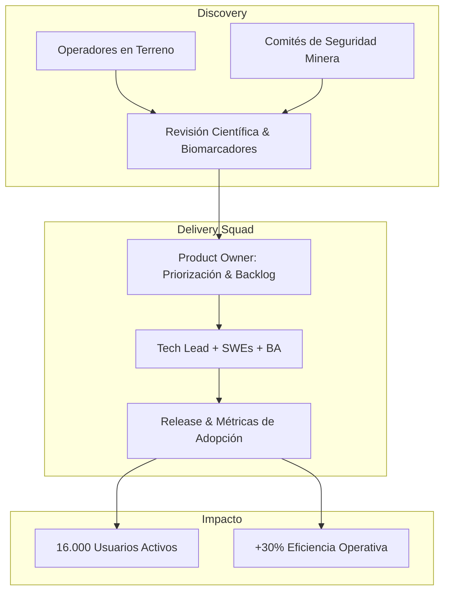

# Caso 02: Gauss Control — Monitoreo de Personas y Riesgo Humano

* **Rol:** Product Owner
* **Período:** Mayo 2026 – Agosto 2026
* **Tipo de Producto:** B2B SaaS Enterprise · IoT & Wearables · Detección de Fatiga y Riesgo
* **Industria:** Minería, Transporte Pesado e Industria Crítica

---

## 1. El Problema (Problem Statement)
En operaciones mineras y faenas industriales de alto tonelaje (*heavy-duty*), la fatiga humana, somnolencia y pérdida de alerta son responsables de un porcentaje crítico de los incidentes fatales y pérdidas millonarias. Las empresas requieren sistemas no invasivos pero altamente predictivos para monitorear el estado psicofisiológico de los operadores en turnos continuos sin interrumpir las operaciones.

> **Objetivo de Producto:** Acelerar el desarrollo y adopción de la suite "Monitoreo de Personas", uniendo neurociencia, procesamiento de señales biológicas y software B2B para anticipar eventos de riesgo antes de que ocurran.

---

## 2. Liderazgo Ágil & Product Discovery en Terreno

### Proceso de Descubrimiento Científico:
* Conduje una revisión sistemática sobre causalidad en accidentabilidad industrial y correlación con biomarcadores y señales fisiológicas.
* Entrevistas de discovery con prevencionistas de riesgos, administradores de contrato minero y operadores en faena para mapear puntos de fricción y resistencia al monitoreo.

### Organización y Squad de Desarrollo:
* Conformé y lideré funcionalmente una célula multidisciplinaria compuesta por **Tech Lead, Business Analyst e Ingenieros de Software**.
* Definición de ceremonias ágiles (Scrum/Kanban), refinamiento de backlog, descomposición de épicas en *User Stories* con criterios de aceptación claros y modelos de negocio para nuevas características.

---

## 3. Desafíos Técnicos y de Negocio

1. **Conectividad Intermitente en Faena:** Adaptación de las funcionalidades del producto para almacenamiento local y sincronización asíncrona cuando los vehículos vuelven a tener cobertura de red.
2. **Adopción y Confianza:** Diseñar flujos centrados en la privacidad del trabajador para que la herramienta no fuera percibida como punitiva, sino como un salvavidas preventivo.
3. **Escalabilidad de Soporte:** El rápido crecimiento de usuarios generaba tickets de soporte técnico repetitivos sobre configuración y estados de conexión.

---

## 4. Métricas e Impacto en Negocio

* **Adopción Masiva:** Impulsé nuevas funcionalidades que alcanzaron **2.000+ descargas** sobre una base de [[JP: completar — universo instalado]] en un producto con una base instalada de **16.000 usuarios activos en terreno** ([[JP: completar — ventana: MAU/DAU]]).
* **Eficiencia Operacional:** Reestructuración de flujos del producto y procesos de soporte, logrando un **+30% en [[JP: completar — métrica exacta, ej. tiempo de resolución de tickets de soporte]] ([[JP: completar — período de medición]])**.
* **Alineación Estratégica:** Entrega de un roadmap evolutivo validado que integró la investigación en neurociencia con lanzamientos quincenales de valor tangible para los clientes mineros.
