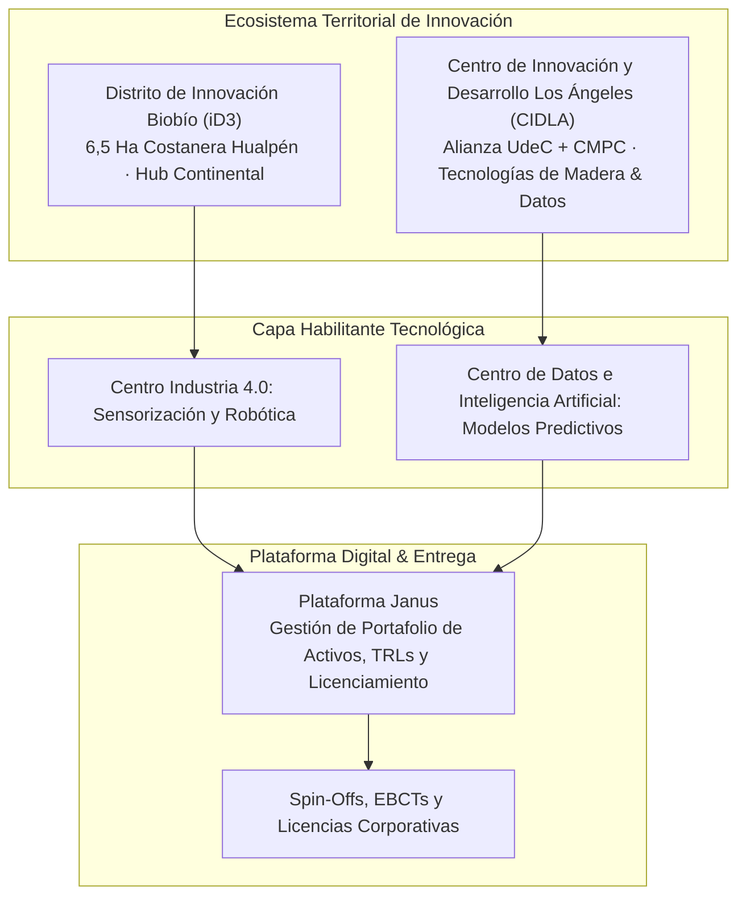

# Caso 03: Distritos de Innovación y Plataforma Janus

* **Rol:** Product Manager & Estratega de Ecosistemas de Innovación
* **Período:** Enero 2022 – Mayo 2026
* **Tipo:** DeepTech Ecosystem Platform · Investor Decks & Financial Modeling · Transferencia Tecnológica
* **Organización:** Vicerrectoría de Investigación y Desarrollo (VRID), Universidad de Concepción
* **Partners Estratégicos:** CMPC, Gobierno Regional del Biobío (FIC-R), Georgia Institute of Technology (Tech Square, Atlanta)

---

## 1. El Desafío (Problem Statement)
A pesar de concentrar el 26% de las solicitudes de patentes del país y una sólida base industrial forestal y manufacturera, la Región del Biobío enfrentaba una fractura crítica en su cadena de valor de innovación:
* **Baja tasa de éxito y madurez de Empresas de Base Científico-Tecnológica (EBCT).**
* **Desconexión entre el I+D universitario y la demanda corporativa.**
* **Falta de infraestructura especializada para pilotaje, manufactura avanzada y ciencia de datos.**

> **Objetivo:** Diseñar la estrategia de producto, modelo de negocio e investor decks para dos distritos de innovación emblemáticos (**iD3 Biobío** y **CIDLA Los Ángeles con CMPC**) y articularlos mediante la plataforma de gestión de activos tecnológicos **Janus**.

---

## 2. Los Proyectos: iD3 y CIDLA

### A. Distrito de Innovación Biobío (iD3)
* **Emplazamiento:** Predio de 6,5 hectáreas en la Costanera de Hualpén frente al río Biobío.
* **Benchmark Internacional:** Co-diseñado con el acompañamiento de **Georgia Institute of Technology**, tomando como referencia **Tech Square en Atlanta** (ecosistema donde nacen más de 100 startups al año).
* **Plan de Desarrollo:** 68.300 m² construidos en 3 fases (Investigación, Innovación y Docencia Tecnológica).
* **[Ver Video Walkthrough 3D de iD3 (Google Drive) ➔](https://drive.google.com/file/d/1RiG2skuzbdjtuD5W71QjgS2UVxHxHhnX/view?usp=sharing)**

### B. Centro de Innovación y Desarrollo Los Ángeles (CIDLA) — Alianza UdeC & CMPC
* **Foco:** Transformar la matriz productiva forestal hacia biomateriales avanzados, nanotecnología y construcción sostenible.
* **Componentes de Tecnología Habilitante:**
  * **Ciencia de Datos (CDIA):** Modelos predictivos y análisis de datos para toma de decisiones industriales.
  * **Manufactura Avanzada (C4i Industria 4.0):** Robótica, fabricación digital y sensorización aplicada.
  * **Área de Demostración Exterior:** 1.000 m² para validación de Métodos Modernos de Construcción (MMC) bajo condiciones reales.

---

## 3. Modelamiento de Negocio & Finanzas (Unit Economics a Gran Escala)

Como líder de la formulación estratégica, estructuré el **modelo de financiamiento público-privado vía Consorcio** y los flujos de ingresos/egresos:

| Métrica Financiera | Valor Proyecto iD3 | Significado de Producto |
| :--- | :--- | :--- |
| **Inversión Total Habilitación** | **MM $152.633 CLP (~MMUS$ 160)** | Infraestructura (CAPEX) + Operación 6 años (OPEX) |
| **VAN (+ Perpetuidad)** | **UF 3.422.720 (MMUS$ 142)** | Viabilidad económica a largo plazo |
| **Tasa Interna de Retorno (TIR)** | **14,3% (UF+)** | Retorno competitivo para banca y fondos privados |
| **Estructura de Capital** | Subsidio 100% OPEX (6 años) + 70% CAPEX Banca | Mitigación de riesgo para inversionistas iniciales |

### Diversificación de Streams de Ingreso:
1. Arriendo y venta de espacios modulares (Cowork, laboratorios, plantas piloto).
2. Ingresos no subsidiados por servicios de I+D+i y **participación accionaria (*equity*) en startups incubadas**.
3. Licenciamiento de activos y modelos de financiamiento colaborativo (Crowdfunding / Tokens).

---

## 4. Plataforma Digital Janus & Product Discovery

Paralelo a la infraestructura física, los activos tecnológicos generados requerían una capa de software para su comercialización y seguimiento:
* **Roadmap de Janus:** Prioricé la evolución técnica de la plataforma Janus para catalogar activos de I+D, medir niveles de madurez tecnológica (TRL 1 a 7) y trazar negociaciones de propiedad intelectual.
* **Discovery para Spin-Offs:** Apliqué entrevistas de descubrimiento y customer development con científicos para identificar casos de uso industriales antes de realizar inversiones de laboratorio.

---

## 5. Impacto, Resultados & Conexión con mi Carrera

* **Aprobación de Etapas Críticas:** Presentación y aprobación del Investor Deck ante el Directorio universitario, autoridades del Gobierno Regional (GORE Biobío) y altos ejecutivos corporativos (CMPC).
* **Consolidación de Metodología:** Integración de los aprendizajes de Georgia Tech en la evaluación sistemática de viabilidad de nuevos emprendimientos.
* **El Génesis de Nauvo:** Entender a fondo los factores de éxito y fracaso al auditar estas iniciativas científicas fue lo que directamente me llevó a investigar modelos formales de evaluación de riesgo en mi tesis de Magíster y posterior fundación de Nauvo.
