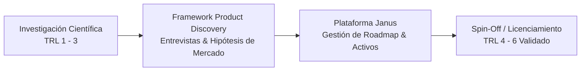

# Caso 03: Janus — Plataforma de Transferencia Tecnológica & Spin-Offs (VRID UdeC)

* **Rol:** Product Manager
* **Período:** Enero 2022 – Mayo 2026
* **Tipo de Producto:** DeepTech / Portfolio Management Platform · Transferencia Tecnológica
* **Institución:** Vicerrectoría de Investigación y Desarrollo (VRID), Universidad de Concepción

---

## 1. El Problema (Problem Statement)
Las universidades y centros de I+D generan invenciones científicas de vanguardia, pero más del 90% se quedan estancadas en el laboratorio ("valle de la muerte" de la ciencia) por falta de metodologías de producto. Los investigadores están orientados a publicaciones académicas, mientras que el mercado y la industria exigen modelos de negocio validados, viabilidad regulatoria y prototipos comerciales (TRL 5+).

Paralelamente, la VRID gestionaba un portafolio creciente de activos tecnológicos sin una plataforma unificada para el seguimiento de madurez tecnológica, propiedad intelectual y negociación de licencias.

> **Objetivo de Producto:** Transformar la gestión de activos científicos mediante la plataforma digital **Janus** y establecer marcos de *Product Discovery* para acelerar la creación de spin-offs universitarias.

---

## 2. Metodología de Product Discovery Científico

Implementé un framework adaptado para científicos e ingenieros investigadores:

1. **De TRL a Product-Market Fit:** Mapeo de hipótesis de cliente desde etapas TRL 2/3, identificando casos de uso comerciales antes de invertir años en desarrollo de laboratorio.
2. **Entrevistas de Descubrimiento con Industria:** Conexión temprana entre científicos y empresas líderes para validar problemas reales en minería, biotecnología, agroindustria y manufactura.
3. **Plataforma Janus:** Definición y ejecución del roadmap de la plataforma interna de gestión y escalabilidad de activos tecnológicos, digitalizando el ciclo de vida de invenciones, patentes y acuerdos de licenciamiento.

---

## 3. Gestión de Stakeholders Complejos

Uno de los mayores desafíos del rol fue la alineación de intereses divergentes:
* **Científicos e Investigadores:** Buscan profundidad técnica, precisión y publicaciones.
* **Directivos Universitarios y Gobierno:** Buscan impacto socioeconómico y cumplimiento regulatorio.
* **Empresas e Inversionistas Privados:** Buscan retorno de inversión, tracción rápida y exclusividad de licencias.

**Solución aplicada:** Desarrollo de narrativas de producto claras y estructuradas, traduciendo complejidad científica en oportunidades de negocio e inversión. Diseñé y presenté el **Investor Deck para Distritos de Innovación Regionales**, logrando la aprobación de etapas críticas por parte del directorio y autoridades gubernamentales.

---

## 4. Resultados & Legado

* **Escalabilidad de Plataforma:** Aseguré la evolución y estabilidad técnica de la plataforma Janus para soportar un volumen creciente de activos de I+D interfacultades.
* **Cultura de Producto:** Capacitación y acompañamiento de múltiples equipos científicos bajo metodologías de validación ágil, acortando tiempos de prototipado inicial.
* **El Puente Narrativo hacia Nauvo:** Esta experiencia liderando comités de transferencia tecnológica y observando las dificultades para predecir el éxito de proyectos en etapas tempranas fue la semilla que motivó la investigación de tesis y posterior fundación de Nauvo.
