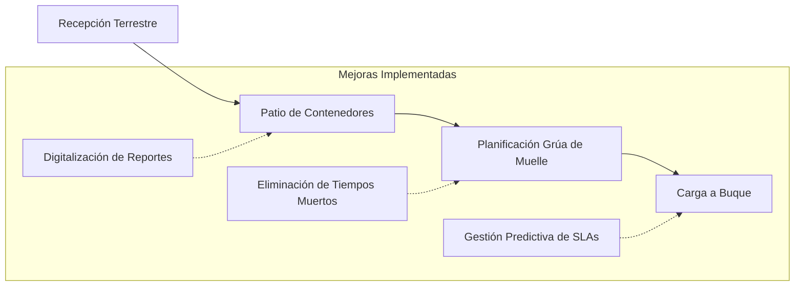

# Caso 04: San Vicente Terminal Internacional (SVTI) — Operaciones Críticas & Flujos Complejos

* **Rol:** Operations Manager
* **Período:** Diciembre 2017 – Enero 2021
* **Industria:** Logística Portuaria, Transporte Marítimo y Comercio Exterior
* **Enfoque de Producto:** Product Operations · Optimización de Procesos con Datos · Gestión de Crisis

---

## 1. El Desafío Operacional
San Vicente Terminal Internacional (SVTI) es uno de los terminales portuarios de mayor actividad del Biobío, canalizando exportaciones críticas (forestal, pesca, manufactura) de las corporaciones más importantes de la zona centro-sur de Chile.

En la logística portuaria, cada minuto de retraso de un buque portacontenedores genera penalizaciones millonarias (*demurrage*) y congestión en toda la cadena de suministro. El terminal enfrentaba cuellos de botella en la recepción de carga terrestre, tiempos muertos en muelles y reportes operativos dispersos.

> **Objetivo:** Optimizar los flujos de carga y descarga, reducir los tiempos de ciclo (Lead Time) y transformar la gestión reactiva en un modelo de operaciones basado en datos y predictibilidad.

---

## 2. Estrategia & Optimización Basada en Datos

Alineado con metodologías de ingeniería de procesos y operaciones de producto (*Product Ops*):

1. **Mapeo de Flujos de Valor (Value Stream Mapping):** Identificación precisa de cuellos de botella en compuertas de acceso (*gates*), patios de almacenamiento y grúas de muelle.
2. **Digitalización de Reportes Operativos:** Sustitución de registros manuales y planillas aisladas por cuadros de mando e indicadores clave (KPIs) en tiempo real para gerencia y clientes corporativos.
3. **Protocolos de Respuesta Rápida:** Rediseño de procedimientos operacionales para contingencias climáticas (cierres de puerto por marejadas) y peaks estacionales de exportación.

---

## 3. Liderazgo en Gestión de Crisis & Clientes Corporativos

* **Acuerdos de Nivel de Servicio (SLAs):** Negociación y cumplimiento de SLAs con gigantes corporativos de la industria forestal y navieras multinacionales, reconstruyendo la confianza operativa.
* **Toma de Decisiones bajo Presión:** Coordinación en terreno de cuadrillas de estiba, maquinaria pesada y personal técnico durante ventanas operacionales de 24/7 sin margen de error.

---

## 4. Impacto en el Negocio & Aprendizajes

* **Aumento de Eficiencia:** Eliminación sistemática de tiempos muertos entre turnos y maniobras de grúas, elevando los rendimientos de transferencia de carga.
* **Predictibilidad Operacional:** Mayor visibilidad del flujo de contenedores para exportadores y agentes aduaneros.
* **Base para mi Carrera de Producto:** Esta experiencia en operaciones portuarias de alto riesgo me otorgó un entendimiento visceral de cómo el software y los datos deben servir a la realidad de los usuarios en terreno, una competencia central que hoy aplico en productos B2B y Enterprise.
